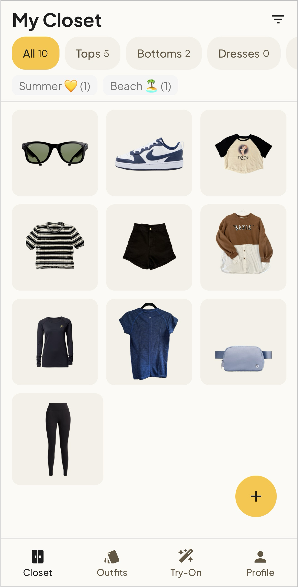
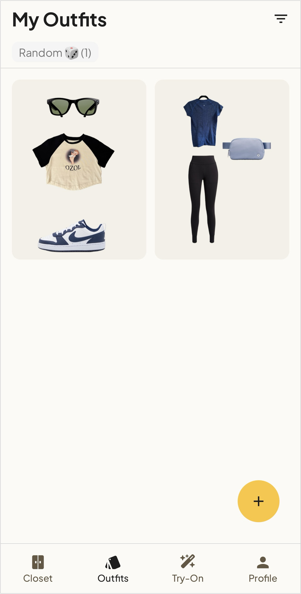
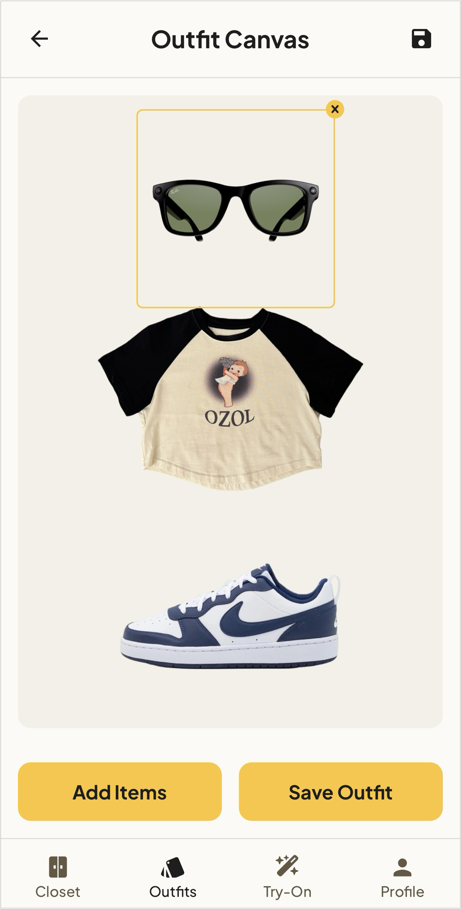
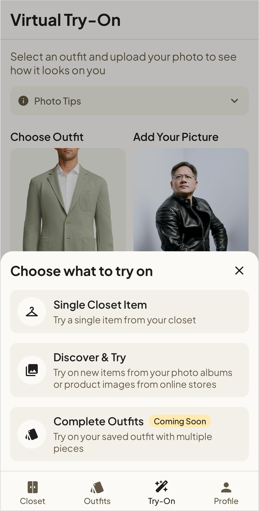
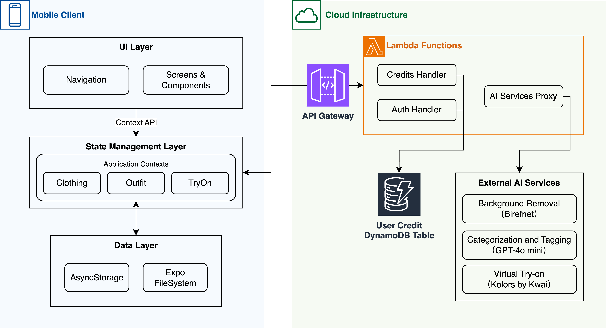

# AI Closet

> *Thank you for checking out AI Closet! If you find it useful or interesting, consider giving this repository a star. It helps others discover the project too.*

[**Hero Image / Banner Placeholder**]

AI Closet is a mobile application that brings an AI-powered approach to closet management and styling. Whether you want to keep track of every piece in your closet, or seek an easy way to visualize outfit ideas, the AI Closet helps you:

   - Digitally store and manage all your clothing.
   - Experiment with outfit combinations on a freeform canvas and save your favorite looks for future inspiration.
   - Preview how items/outfits (even from online stores) might look on you using virtual try-on technology.

The app is built with React Native and Expo, offering a cross-platform solution for both iOS and Android users. By integrating AI for tasks like automatic background removal and smart categorization, it reduces manual work and helps users stay organized and creative with their wardrobe.

---

## Key Features

[Screenshot placeholder: All Clothing Items screen]



1. **Add & Manage Clothing Items**  
   - Easily add clothing items from the camera or gallery. 
   - AI automatically removes backgrounds and assigns attributes (e.g., category, color, season).

[Screenshot placeholder: All Clothing Items screen]



2. **Create & Save Outfits**
   - Mix and match items on a freeform canvas, drag-and-drop items to arrange the perfect look.
   - Store finished outfits and revisit them anytime to make updates or get inspiration.
   - Each clothing item lists the outfits it belongs to.

[Screenshot placeholder: All Clothing Items screen]

3. **Virtual Try-On**  
   - Upload a personal photo and let the AI generate an approximate look of how a clothing item or outfit appears on you.
   - Keep track of previous try-on sessions to revisit or share them later.

---

## Tech Stack

**Client-side:**

- **TypeScript** as the primary language.
- **React Native** for cross-platform mobile development (iOS & Android).
- **Expo** for easy setup and development workflow.
- **AsyncStorage & expo-file-system** for local data persistence.

**Cloud & AI Services:**

- **Various AWS Services** (API Gateway, Lambda, DynamoDB, S3)

---

## Installation and Usage

1. **Clone the Repository:**
   ```bash
   git clone [Your Repo URL Here]
   cd [Your Repo Name]
   ```

2. **Install Dependencies:**
   ```bash
   npm install
   ```

3. **Configure Environment:**  
   - The AI features require require the following APIs and keys, add them to your environment variables:
   ```bash
   EXPO_PUBLIC_OPENAI_KEY = ""
   EXPO_PUBLIC_FAL_KEY = ""
   EXPO_PUBLIC_KWAI_ACCESS_KEY = ""
   EXPO_PUBLIC_KWAI_SECRET_KEY = ""
   ```

4. **Run the App:**
   ```bash
   npm start
   # Use the Expo CLI to run on an emulator, simulator, or physical device
   ```

   The app should now be running on your local machine. You can access it via the Expo client on your mobile device or an emulator.

---

## Architecture and Future Roadmap



### Current Implementation (Client-Side)
1. **UI Layer**: Built with React Native to support iOS and Android.
2. **State Management Layer**: Powered by React Context API to manage global state and ensure efficient updates.
3. **Data Layer**: Uses AsyncStorage and `expo-file-system` for local data (e.g., metadata and images).

### Planned Cloud Components
1. **API Gateway**: Will be introduced to securely proxy API requests while hiding and protecting sensitive API keys.
2. **Rate Limiting System**: A backend serverless function (AWS Lambda) to check user credits before forwarding API requests, and updates credit usage and logs transactions in DynamoDB.
3. **AI Services**: Current third-party AI services will move behind a proxy to enforce rate limits and protect API keys.

> **Note:** Currently only the client-side components are implemented. Third-party AI services are residing in the client-side codebase. The cloud-based features and credit-based system are in the planning stage.

For more details on the current architecture of implemented features, refer to the [design_doc](/design_doc.md).

### Future Features
(in no particular order)
- **Batch Clothing Upload**: Add multiple clothing items at once for faster initial closet setup.
- **Social Sharing & Export**: Easily share outfits to social media or with friends.
- **User Onboarding Screens**: Introduce new users to the app and its features.
- **Outfit Calendar**: Track daily outfits and look back at past styles.
- **Closet Analytics**: Gather insights like items per category, color distribution, etc.
- **Multi-item Try-On Options**: Support multi-item try-on such as full outfits or multiple items at once.
- **Credit-Based Premium Features**: Implement a system that allows users to purchase credits for expensive AI functionalities (mainly virtual try-ons or large-scale operations).

---

## Productization Considerations

One key differentiator of AI Closet is the **integrated virtual try-on plus wardrobe management**—an all-in-one approach compared to many closet-only or try-on-only apps.

Cost Estimation:

The app integrates with third-party AI APIs, billed based on usage.

| Service                            | Cost/Usage    |
|------------------------------------|---------------|
| **Background Removal (Birefnet)**  | \$0.002/image |
| **Clothing Categorization (GPT-4o)**| \$0.002/image |
| **Virtual Try-On (Kolors by Kwai)**| \$0.1/try-on  |

Assuming an average user uploads 50 images per month, the estimated monthly cost per user would be around $0.20 for simple usage (not counting try-ons). However, for users who want to use the virtual try-on feature more frequently, a credit-based system can be implemented. Example:

- **50 credits for \$10**; each try-on = 1 credit.

This system would provide a revenue stream while keeping the app free for most users.

The backend AWS cost is minimal, but are crucial for implementing secure credit-based or pay-as-you-go models in the future. This is included for reference:

- **API Gateway**: \$3.50 for first 333M requests  
- **AWS Lambda**: \$0.20 per million requests  
- **DynamoDB**: \$0.7 per million writes, \$0.2 per million reads  


---

## Contributing

Contributions are appreciated! Whether it’s a bug fix, new feature proposal, or performance optimization.

For major changes, please open an issue first to discuss what you’d like to change. This ensures we’re aligned and helps us provide guidance.

---

## License

This project is licensed under the MIT License.

---

## Contact & Support

- **Issues / Bug Reports:** Please use the [GitHub Issues](#) tab to report bugs or request features.
- **Questions / Suggestions:** Feel free to open a discussion in our [Discussions](#) tab.
